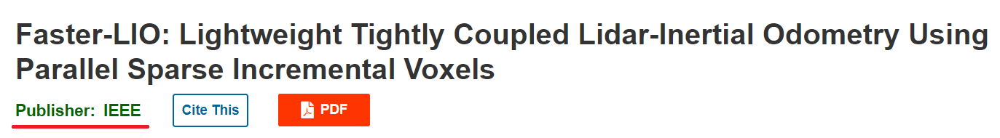
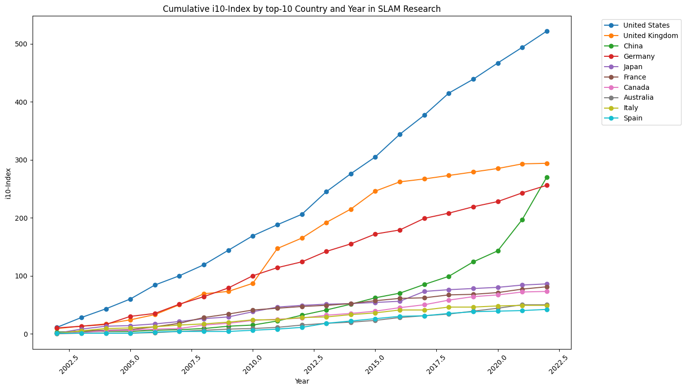
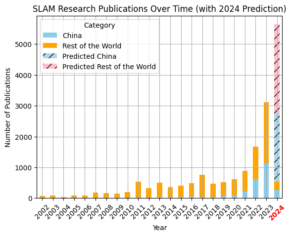

# SLAM_article_statistics

Midterm. Case Study of Statistical Techniques for Data Science and Robotics

## Case Study. Midterm

Students:  

- Artem Voronov (<a.voronov@innopolis.university>)
- Roman Voronov (<r.voronov@innopolis.university>)

___
**Research topic:** *"Investigating the Evolution and Impact of SLAM Research in China Compared to Global Trends Over the Last Decade"*

## 1. Introduction

> This section will discuss our motivation for the topic, provide a brief background, and propose some research questions.

### 1.1 Motivation

We are currently writing a joint thesis: "Customization and Enhancement of the FasterLIO Algorithm in Construction Environments: Insights from the Hilti SLAM Challenge".  In the process of making Related works, we collected articles for insight. In addition, we consulted with our supervisor and asked him for articles for overview. It was surprising that the majority (9 out of 10) of these works were authored by the Chinese. We wondered if China was the leader in the field of LiDAR SLAM, or if we had a very limited sample.

In our work, we have formulated research questions, analyzed the options and selected CrossRef as the database for scientific papers. We filtered out the data and filled in the missing locations based on the authors and journals. After that, we conducted a statistical analysis and maked a conclusion about the evolution of the SLAM realm.

### 1.2 Research Questions

Including all of the above, we have formulated the following questions:

1. **Quantitative Growth in SLAM Research:** Has the number of research articles on SLAM increased in China over the past 10 years, and how does this trend compare to the global growth in SLAM research publications?

2. **Correlation of Publication Growth:** Does the growth in the number of SLAM publications in China correlate with the growth of SLAM publications worldwide? This question aims to identify if there's a parallel trend or if China's growth in SLAM research is distinctive in some way.

3. **Comparative Analysis of Publication Quality and Quantity:** Is the number and quality (as indicated by citations, journal impact factors, and possibly other metrics like awards or recognition within the scientific community) of scientific publications on SLAM from China higher than similar publications from other countries? This involves not just a quantitative analysis but also a qualitative assessment to gauge the global standing of China's contributions to the SLAM field.

### 1.3 Background

> Here we will provide a brief introduction to the specific details necessary to fully understand the context

Simultaneous Localization and Mapping (SLAM) algorithms form the basis of robotics and autonomous systems, allowing them to navigate and understand their surroundings. Broadly speaking, this algorithm uses data from sensors to create a map of the environment, along with the robot's position on it. There are two main types of SLAM: visual and laser. They differ in the type of sensor used. In our work, we will focus only on the laser SLAM, which uses LiDAR to measure the environment.

Sensor LiDAR (light detection and ranging) provides precise, high-resolution measurements of distances to surrounding objects. Lidar systems are classified as either two-dimensional (2D) or three-dimensional (3D), and they vary in field of view (FOV).

Crossref is a nonprofit organization that enhances scholarly communication by providing a system for citation linking and metadata storage for academic content. It assigns DOIs to scholarly works, facilitating persistent access and reliable citation. Choosing Crossref for statistical analysis has several benefits due to its comprehensive database and robust metadata collection. This allows for precise tracking of publications, citations, and trends within the SLAM field.

## 2. Data Collection

> What difficulties we encountered and how we managed to obtain and recreate some of the data.

We concentrated on articles in English with keywords (SLAM & LIDAR) in the Crossref database.  
In total, we found 46933 works.

The following programs were written to collect the information:

- [1 get_articles_cross_ref.ipynb](src/1%20get_articles_cross_ref.ipynb) - Retrieving data from crossref, identifying important information, saving results to file: *slam_article.csv*
- [2 get_country_by_address.ipynb](src/2%20get_country_by_address.ipynb) - By address, university, and affelation find the country that published the work, saving results to files: *'\*_dict.csv'*
- [3 add_country_to_dataset.ipynb](src/3%20add_country_to_dataset.ipynb) - Adding a new column with countries to a dataset, saving results to file: *slam_articles_with_country.csv*

### 2.1 Choosing API for retrieving articles list

The original plan was to retrieve the list of articles from **Google Scholar**. However, google does not provide an official API for this, so after some searches the **Serpapi** framework was found.
It had problems with the fact that the free version allows you to make only 100 requests per month, and each request can get no more than 20 articles. So we continued our search.  
There were attempts to get information from **IEEE**, **ResearchGate**, **Arxiv.org**. However, the first two also did not have an official API, and the number of articles on SLAM on the Arxiv site was not very large (1696).  
In the end, the source **Crossref** was found, which has a large number of articles, as well as a convenient framework for obtaining the list of articles.

### 2.2 Retrieving information about articles

The maximum number of articles that can be retrieved from one query is 1000, so to retrieve all articles (~ 47 000) we need to make 47 consecutive queries.

We need to know the country where the article was written. In the additional information in crossref there are such fields: 'publisher', 'publisher_location'. However, the publisher does not always accurately give the country that did the research.

For example, the article *Faster-LIO: Lightweight Tightly Coupled Lidar-Inertial Odometry Using Parallel Sparse Incremental Voxels*, was written by the famous MARS lab in Hong Kong, but its publisher is IEEE.  

To determine the country, we decided to first use the affelation of the main author, for example: "*Department of Electronic Information and Engineering, Tsinghua University, Beijing, China*"

### 2.3 Finding countries by affiliations, and universities

Many field values do not contain countries, so we used the geopy.geocoders service to obtain them.  
Example of addresses and obtained countries:

- KAIST, Dept. of Civil and Envtl. Eng., Daejeon, South Korea -> South Korea
- Institute for Research of Applicable Computing University of Bedfordshire, Luton, UK -> United Kingdom
- Boston, MA -> United States
- Massachusetts Institute of Technology -> United States
- School of Computer Engineering and Science, Shanghai University, Shanghai -> China

As a result, about 26% of articles with countries were obtained in this way:  
> 12225/46933 (26.0%) articles with country

## 3. Methods

> Material on general statistical topics, such as hypothesis testing and parameter estimation, and such as goodness-of- fit tests, bootstrap, etc.

- **Time-series analysis:** Time-series analysis is a statistical technique used to analyze a sequence of data points collected over time intervals. This method helps identify trends, seasonal patterns, and cyclic variations within the data. By applying time-series analysis, one can forecast future values based on the historical patterns observed. It's widely used across various fields such as economics, weather forecasting, stock market analysis, and more, to make informed predictions and understand temporal dynamics. This approach is valuable for detecting consistent patterns over time and can be crucial for decision-making processes that rely on understanding how certain variables evolve.

- **h-index:** The h-index measures both the productivity and citation impact of a researcher's published work. Specifically, a researcher has an index of h if h of their N papers have at least h citations each, and the other (N − h) papers have no more than h citations each. This index attempts to balance the quantity (number of publications) and quality (citations per publication), making it a robust indicator of a researcher's overall impact. In our work we apply this metric to the country.

- **i10-index:** The i10-index focuses on the productivity aspect by counting the number of publications by a researcher that have received at least 10 citations. This simpler metric emphasizes publications that have achieved a basic level of recognition in the scholarly community. In our work we apply this metric to the country.

## 4. Results

<figure>
  
  <figcaption>Cumulative i10-Index by top-N Country and Year in SLAM Research</figcaption>
</figure>

<figure>
  
  <figcaption>SLAM Research Publications Over Time (with 2024 Prediction)</figcaption>
</figure>

## 5. Conclusion

<!-- > Clear answer(s) to the question(s). Threats to validity: explain why your results may be invalidated (under which conditions?)  -->

3. **Comparative Analysis of Publication Quality and Quantity?**  
Over the past 5 years, China has significantly increased from 6.9% in 2018 to 36.2% in 2023 of the total publications in this field, becoming the leader in the number of publications.  
However, in other criteria such as h-index and i10-index, the USA remains the leader. China, meanwhile, shows the highest growth in these criteria.  
[Code and visualization](src/4%20visualizing.ipynb)

Our comprehensive analysis of the growth patterns in SLAM research publications across different regions, with a keen focus on China and comparisons with the three other countries contributing significantly to the field, has yielded insightful observations. Here's a summary of our key findings:

Rapid Acceleration in SLAM Research: Across the board, the SLAM research domain is experiencing a robust upward trajectory. The data indicates a widespread increase in the number of articles published over the last decade, suggesting a growing global interest and investment in SLAM technologies.

Distinctive Growth Pattern of China: Among the four leading countries in SLAM research, China stands out for its unique growth pattern. The analysis reveals that China's SLAM research has the smallest linear component coupled with the largest exponential component. This pattern indicates that China, despite its relatively late surge in activity within this domain, is now experiencing the most rapid growth. This acceleration suggests a strategic and substantial investment in SLAM research and development, positioning China as a burgeoning epicenter for SLAM innovation.

Global Contributions and Comparative Analysis: While China demonstrates the most pronounced exponential growth in SLAM research, the contributions from other leading countries remain substantial, showcasing a diversified advancement in the field. The linear and exponential modeling of publication trends in these countries reflects a more matured phase of steady research output and possibly a saturation point in the volume of new publications. [Trend analisys](src/5%20trend_analisys.ipynb)

**Implications and Future Directions:** The distinct growth trajectory of China in SLAM research highlights a pivotal shift in the global landscape of technological advancements in this area. For policymakers, educators, and researchers, understanding these dynamics is crucial for fostering collaborations, directing funding, and prioritizing research agendas. Future research should explore the qualitative aspects of these publications, such as citation impact, to further elucidate the global standing and influence of China's contributions to SLAM research.

In conclusion, our study underscores the dynamic nature of SLAM research globally, with China rapidly emerging as a leading force. This trend not only enriches the global research ecosystem but also sets the stage for innovative breakthroughs and applications in SLAM technologies. As the field continues to evolve, monitoring these trends will be paramount in understanding the shifting centers of research excellence and their implications for global technological advancements.

## 6. References

- [1] chat GPT4
- [2] CrossRef

## 7.  Contributions of co-authors

This project was completed in a group with an even contribution from the authors. To be more specific, Roman was responsible for collecting, filtering, and preparing the dataset, while Artem was responsible for the structure and content of the report. The analysis and statistical part of the work were completed together.
